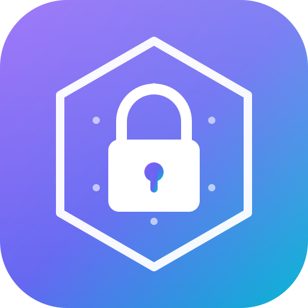
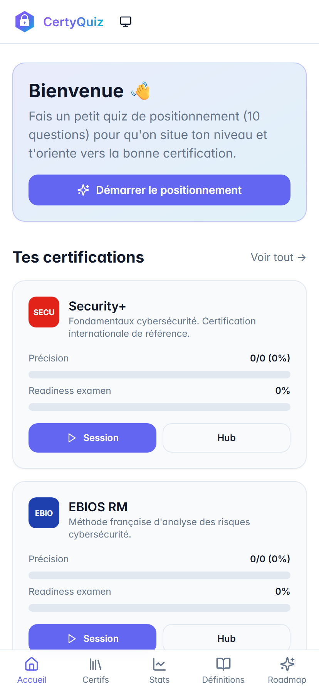
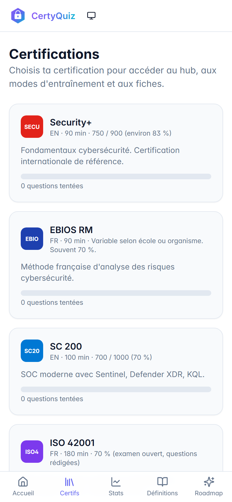
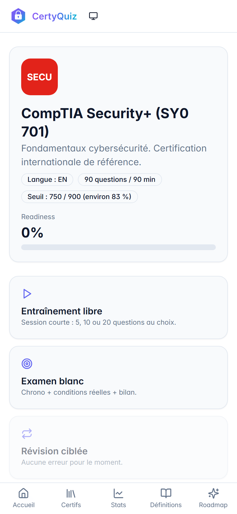
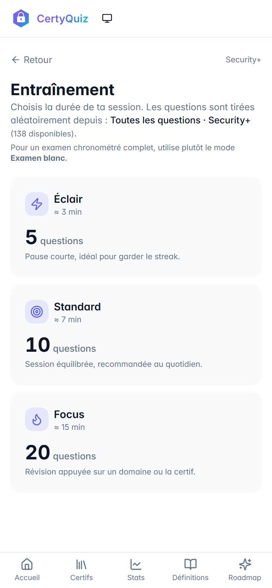
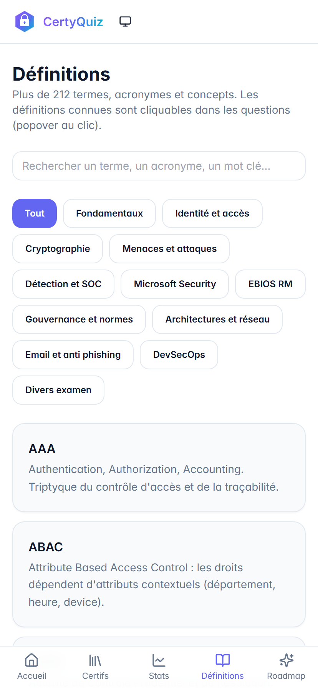
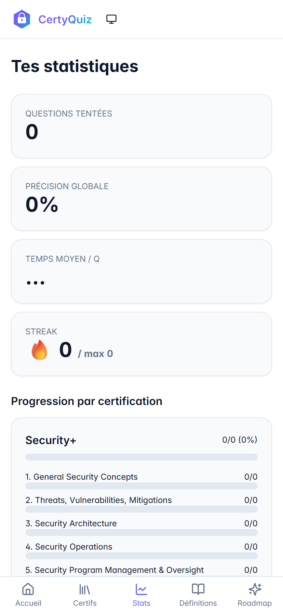
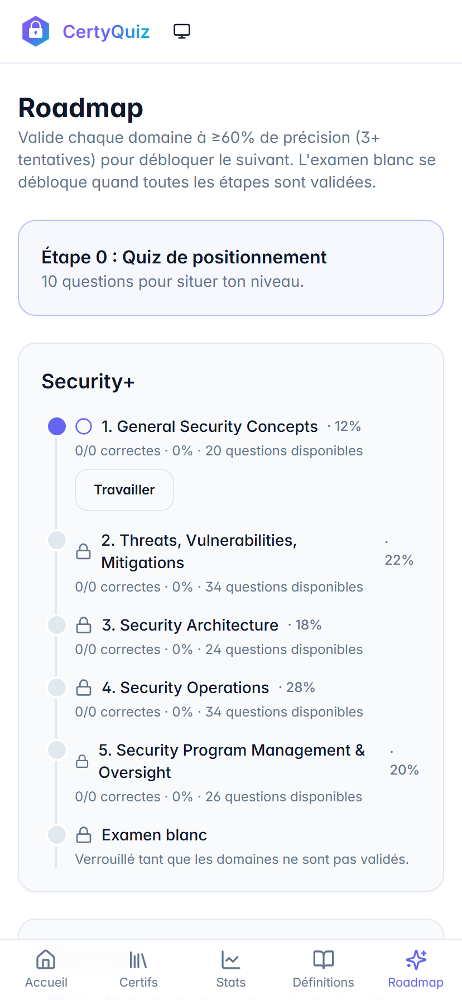

<div align="center">



# CertyQuiz

**Préparation gamifiée aux certifications cybersécurité — Duolingo + Quizlet pour la cyber.**

[](https://certyquiz.vercel.app)
[](https://certyquiz.vercel.app)
[](LICENSE)

</div>

---

## Aperçu

Une PWA gamifiée pour préparer **7 certifications cybersécurité** : Security+, EBIOS RM, SC-200, ISO 42001, CISSP, CISA, et Gouvernance EFREI. Chaque question est rédigée avec une **rationale par option** (pas seulement la bonne réponse), un **shuffle anti-biais**, et un mode **examen blanc chronométré** calé sur les conditions réelles.

> **Disponible en 1 clic** sur https://certyquiz.vercel.app — installable sur l'écran d'accueil iOS/Android (PWA, fonctionne **offline** après la 1ère visite).

> ⚠️ **Toutes les questions livrées sont rédigées originalement** par CertyQuiz à partir des objectifs publics et cours associés. Aucune question d'examen réel n'est reproduite. Si une question provient d'un support officiel public (practice assessment Microsoft Learn, MOOC EBIOS), un attribut `official: true` affiche une **bannière rouge** explicite.

<div align="center">

|                                          |                                            |                                                |
| :--------------------------------------: | :----------------------------------------: | :--------------------------------------------: |
|  |  |  |
|     **Accueil — choisis ta certif**     |       **Liste des certifications**       |        **Hub d'une certif (modes)**         |

|                                              |                                              |                                            |                                            |
| :------------------------------------------: | :------------------------------------------: | :----------------------------------------: | :----------------------------------------: |
|  |  |  |  |
|       **Entraînement — choix de durée**       |     **Glossaire — 212 définitions**      |    **Stats — précision par domaine**     |   **Roadmap — déblocage progressif**    |

</div>

---

## Contenu pédagogique

### 7 certifications couvertes

| Certif | Domaines | Format examen | Questions disponibles |
| --- | --- | --- | --- |
| **CompTIA Security+** (SY0-701) | 5 domaines fondamentaux | 90 Q · 90 min · 750/900 | **138** |
| **EBIOS Risk Manager** | 5 ateliers ANSSI | Variable | **108** |
| **Microsoft SC-200** | SOC, Sentinel, Defender, KQL | 40-60 Q · 100 min · 700/1000 | **98** |
| **ISO 42001** (IA Management) | 10 clauses + Annex A | Examen ouvert | **20** |
| **CISSP** | 8 domaines (ISC²) | 100-150 Q · 3h · 700/1000 | **99** |
| **CISA** | 5 domaines (ISACA) | 150 Q · 4h · 450/800 | **80** |
| **Gouvernance EFREI** | Cours M1 IAM | Variable | **110** |

> **Total : ~650 questions originales**, augmenté à chaque release.

### Banque de connaissances

- **212 entrées** dans le glossaire (Fondamentaux, IAM, Crypto, Réseau, Cloud, Détection/SIEM, Réglementation, EBIOS, Gouvernance EFREI…)
- **20 flashcards** recto/verso pour les concepts critiques
- **13 fiches de cours** (2-3 min de lecture) avec popovers de glossaire intégrés
- **Mnémoniques** pour mémoriser les listes obligatoires (5 ateliers EBIOS, 8 domaines CISSP, etc.)

---

## Fonctionnalités clés

### 🎯 Entraînement libre
Quiz sans chrono, **correction immédiate**, **rationale par option** (pourquoi A est juste, pourquoi B/C/D sont fausses), liens vers les sources officielles. 3 durées au choix : Éclair (5 Q · 3 min), Standard (10 Q · 7 min), Focus (20 Q · 15 min).

### 📝 Examen blanc chronométré
**Conditions réelles** par certif :
- Security+ : 90 questions / 90 minutes / seuil 750
- CISSP : 100 questions / 180 minutes / seuil 700
- SC-200 : 40 questions / 100 minutes / seuil 700
- (etc.)

À la fin : bilan détaillé par domaine, identification des faiblesses, suggestion de révision ciblée.

### 🔁 Révision ciblée
Refait uniquement les questions ratées, **ordonnées par fréquence d'erreur**. Plus tu te trompes sur une question, plus elle remonte.

### 🧪 Quiz de positionnement
10 questions à l'onboarding pour calibrer ton niveau et te suggérer la certif la plus adaptée.

### 🛡️ Shuffle anti-biais position A
L'ordre des options est **mélangé à l'affichage** via Fisher-Yates seedé sur `question.id` :
- **Stable** pendant qu'une question est affichée (pas de saut au clic)
- **Change** entre deux montages (révision)
- La lettre A/B/C/D suit la position **visuelle**, pas l'id interne
- Tracking par id (`'a'`, `'b'`...) → validation et rationales restent corrects

→ La bonne réponse n'est plus mémorisable par sa position. Sur **toutes** les certifs.

### 🗺️ Roadmap par certif
Étapes débloquées progressivement : tu valides un domaine quand tu atteins **≥ 60% de précision** sur 3+ tentatives. L'examen blanc ne se débloque qu'une fois tous les domaines validés.

### 📊 Statistiques détaillées
- Précision par domaine
- Streak quotidien (jours consécutifs)
- Badges (10, 50, 100, 500 questions)
- **Readiness** par certif (estimation prête-à-passer-l'examen)
- Temps moyen par question

### 📱 PWA installable + offline
Manifest + service worker (vite-plugin-pwa, Workbox). Une fois la 1ère visite faite, **fonctionne sans connexion**. Données et questions cachées localement.

### ♿ Accessibilité
Mode **clair / sombre / système** · contraste AA · ARIA · navigation clavier complète.

---

## ⚠️ Important — Sauvegarde des données

L'app est **100% locale** (pas de serveur, pas de compte). Ta progression (réponses, précision, streak, badges) est stockée sur ton appareil via `localStorage`.

### 👉 Installe l'app sur l'écran d'accueil

Pour ne **jamais perdre ta progression** :

- **iOS Safari** : bouton « Partager » → « Sur l'écran d'accueil »
- **Android Chrome** : menu ⋮ → « Ajouter à l'écran d'accueil » (ou bandeau d'install qui apparaît automatiquement)

Une fois installée, l'app tourne en mode standalone (sans la barre d'adresse) et ses données sont protégées des nettoyages automatiques.

> **Pas de compte, pas de cloud auto, pas de multi-device par défaut** — chaque appareil est un silo isolé. Tu fais ton training sur le tel ? Le streak ne sera pas sur l'ordi. C'est un choix volontaire (privacy first), une sync optionnelle pourrait être ajoutée plus tard.

---

## Installation locale

Prérequis : **Node 18+** et **npm** (ou pnpm / yarn).

```bash
git clone https://github.com/Fumikage-DarkShadow/CertyQuizz.git
cd CertyQuizz
npm install
npm run dev
```

L'app est accessible sur http://localhost:5173.

### Build et déploiement

```bash
npm run build      # tsc -b && vite build
npm run preview    # sert le contenu de dist/ en local
```

Le dossier `dist/` est déployable sur Vercel, Netlify, Cloudflare Pages, ou tout hébergeur statique.

**Déploiement actuel** : Vercel, projet `certyquiz`, auto-deploy sur push `main`. URL stable : https://certyquiz.vercel.app

> En cas d'ancienne version affichée après un push : `Ctrl + Shift + R` pour bypasser le cache du service worker, ou DevTools → Application → Service Workers → Unregister.

---

## Architecture

```
src/
├── components/        # UI réutilisable (Layout, QuizCard, ProgressBar, CertLogo, Popover…)
├── data/              # Banques de questions, fiches, glossaire, mnémos
│   ├── certifications.ts     # Métadonnées des 7 certifs (durées, seuils, domaines)
│   ├── flashcards.ts         # 20 cartes recto/verso
│   ├── course-sheets.ts      # 13 fiches de cours
│   ├── glossary.ts           # 212 définitions
│   ├── mnemonics.ts          # Aides mnémotechniques
│   ├── security-plus/        # ~138 questions
│   ├── ebios-rm/             # ~108 questions
│   ├── sc-200/               # ~98 questions
│   ├── iso-42001/            # ~20 questions
│   ├── cissp/                # ~99 questions
│   ├── cisa/                 # ~80 questions
│   └── efrei-gouvernance/    # ~110 questions
├── hooks/             # useTheme
├── pages/             # Home, Certifications, CertHub, Training, Exam, Review,
│                      # Flashcards, Stats, Definitions, Roadmap, Onboarding, CourseSheet
├── store/             # progress.ts (Zustand persisté dans localStorage)
├── types/             # Question, Certification, GlossaryEntry, Progress…
└── lib/               # Helpers (cn, …)
```

---

## Ajouter du contenu

### Une question

Chaque question suit le type `Question` de [`src/types/index.ts`](src/types/index.ts) :

```ts
{
  id: 'efr-g6-99',
  certId: 'efrei-gouvernance',
  domainId: 'g6',
  type: 'single',          // 'single' | 'multi' | 'pbq'
  difficulty: 'medium',    // 'easy' | 'medium' | 'hard'
  prompt: 'Question lisible…',
  scenario: '…',           // optionnel, contexte pour PBQ
  options: [
    { id: 'a', text: '…', rationale: 'pourquoi A est bonne ou fausse (1 phrase)' },
    { id: 'b', text: '…', rationale: '…' },
    { id: 'c', text: '…', rationale: '…' },
    { id: 'd', text: '…', rationale: '…' },
  ],
  correct: ['a'],          // ids des bonnes options
  explanation: 'Phrase clé à retenir',
  references: [{ label: 'NIST SP 800-53', url: 'https://…' }],
  tags: ['governance', 'iso27001'],
  official: false,         // true → bannière rouge "question officielle"
}
```

Ajoute-la dans le fichier de la certif concernée (par ex. `src/data/efrei-gouvernance/questions.ts`). Elle est immédiatement disponible dans **tous** les modes (entraînement, examen, révision ciblée, stats).

### Une certification

1. Ajouter le nouvel id dans le union type `CertId` de [`src/types/index.ts`](src/types/index.ts)
2. Insérer un objet `Certification` dans [`src/data/certifications.ts`](src/data/certifications.ts) (id, name, shortName, tagline, hexColor, examMinutes, examQuestions, passingScore, domains, resources)
3. Créer le dossier `src/data/<id>/questions.ts` et exporter un `Question[]` typé
4. L'importer dans [`src/data/index.ts`](src/data/index.ts) et l'ajouter à `QUESTIONS`
5. Ajouter une entrée dans `EXAM_CONFIG` de [`src/pages/Exam.tsx`](src/pages/Exam.tsx) (questions, minutes, passPct)
6. (Optionnel) Déposer un logo PNG dans `public/certs/<id>.png` et le référencer via `logoPath`

---
